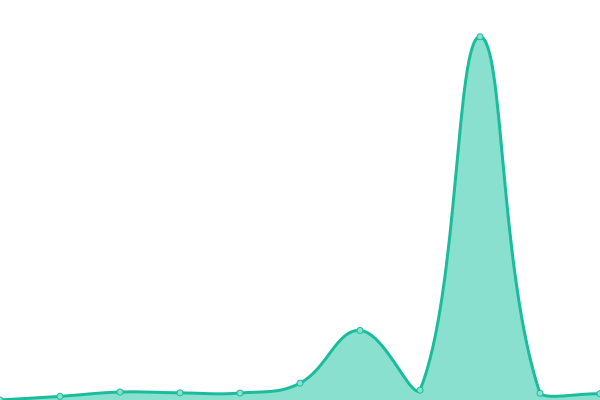

# [📈 Live Status](https://demo.upptime.js.org): <!--live status--> **🟩 All systems operational**

This repository contains the open-source uptime monitor and status page for [Martin Bove](https://demo.upptime.js.org), powered by [Upptime](https://github.com/upptime/upptime).

With [Upptime](https://upptime.js.org), you can get your own unlimited and free uptime monitor and status page, powered entirely by a GitHub repository. We use [Issues](https://github.com/mbove77/upptime/issues) as incident reports, [Actions](https://github.com/mbove77/upptime/actions) as uptime monitors, and [Pages](https://demo.upptime.js.org) for the status page.

<!--start: status pages-->
<!-- This summary is generated by Upptime (https://github.com/upptime/upptime) -->
<!-- Do not edit this manually, your changes will be overwritten -->
<!-- prettier-ignore -->
| URL | Status | History | Response Time | Uptime |
| --- | ------ | ------- | ------------- | ------ |
|  [Fanalitica](https://www.fanalitica.com) | 🟩 Up | [fanalitica.yml](https://github.com/mbove77/upptime/commits/HEAD/history/fanalitica.yml) | 

 676ms
     
 | 

<a href="https://demo.upptime.js.org/history/fanalitica">94.35%</a>
    

|  [Atlas](https://www.atlasfc.com.mx) | 🟩 Up | [atlas.yml](https://github.com/mbove77/upptime/commits/HEAD/history/atlas.yml) | 

 74ms
     
 | 

<a href="https://demo.upptime.js.org/history/atlas">100.00%</a>
    

|  [Cruzados](https://www.cruzados.cl) | 🟩 Up | [cruzados.yml](https://github.com/mbove77/upptime/commits/HEAD/history/cruzados.yml) | 

 245ms
     
 | 

<a href="https://demo.upptime.js.org/history/cruzados">100.00%</a>
    

|  [Puebla](https://www.clubpuebla.com) | 🟩 Up | [puebla.yml](https://github.com/mbove77/upptime/commits/HEAD/history/puebla.yml) | 

 326ms
     
 | 

<a href="https://demo.upptime.js.org/history/puebla">99.67%</a>
    

|  [Santos](https://www.clubsantos.mx) | 🟩 Up | [santos.yml](https://github.com/mbove77/upptime/commits/HEAD/history/santos.yml) | 

 126ms
     
 | 

<a href="https://demo.upptime.js.org/history/santos">100.00%</a>
    

|  [Jaiba Brava](https://www.lajaibabrava.mx) | 🟩 Up | [jaiba-brava.yml](https://github.com/mbove77/upptime/commits/HEAD/history/jaiba-brava.yml) | 

 90ms
     
 | 

<a href="https://demo.upptime.js.org/history/jaiba-brava">100.00%</a>
    

|  [Mazatlan](https://www.mazatlanfc.com) | 🟩 Up | [mazatlan.yml](https://github.com/mbove77/upptime/commits/HEAD/history/mazatlan.yml) | 

 87ms
     
 | 

<a href="https://demo.upptime.js.org/history/mazatlan">100.00%</a>
    

<!--end: status pages-->

[**Visit our status website →**](https://demo.upptime.js.org)

## 📄 License

- Powered by: [Upptime](https://github.com/upptime/upptime)
- Code: [MIT](./LICENSE) © [Martin Bove](https://demo.upptime.js.org)
- Data in the `./history` directory: [Open Database License](https://opendatacommons.org/licenses/odbl/1-0/)
